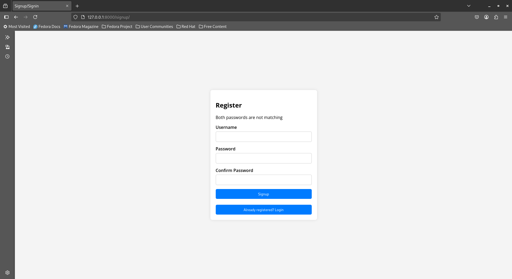

# Django Installation Setup

```sh
$ git clone https://github.com/selmanfariz18/User_authentication_in_django
$ cd User_authentication_in_django
$ python manage.py makemigrations
$ python manage.py migrate
$ python manage.py runserver
```

Server will be running on `http://127.0.0.1:8000`.

# Screenshots

- 
- 
- 
- 
- 
